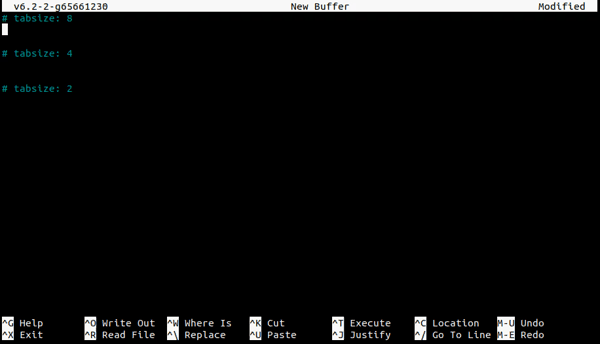

# GNU nano (6.2) - Set Tabsize Dynamically

[](https://github.com/davidhcefx/GNU-nano-6.2_Set-Tabsize-Dynamically/actions/workflows/build.yml)

Some files use *two spaces* for indentation (eg. [HTML](https://www.w3schools.com/html/html5_syntax.asp)), while others use *four* (eg. [Python](https://peps.python.org/pep-0008/#indentation)). In the middle of editing a file, I always wish I could change the **tab width** without reopening the file (= loss of history). This patch achieves our goal!

## Usage

For example, bind `M-4` to `settabsize` in your rcfile:

```nanorc
bind M-4 settabsize main
```

then you can change tabsize on the fly\!




## How to compile

*Please refer to [README.GIT](/README.GIT) for more details.*

1. Install the dependencies: `apt install autoconf automake autopoint gcc gettext git groff make pkg-config texinfo libncurses5-dev`

2. Run `./autogen.sh`.

3. After that, just do the normal `./configure`, `make` and `make install`.


## Patch for Nano v6.2
```patch
From 9c8893604886abbfaefa15229c91308d067390a9 Mon Sep 17 00:00:00 2001
From: davidhcefx <davidhu0903ex3@gmail.com>
Date: Mon, 27 May 2024 15:33:20 +0800
Subject: [PATCH] Feature: change tabsize dynamically

---
 doc/nanorc.5     |  3 +++
 src/global.c     |  4 ++++
 src/prototypes.h |  1 +
 src/rcfile.c     |  2 ++
 src/text.c       | 22 ++++++++++++++++++++++
 5 files changed, 32 insertions(+)

diff --git a/doc/nanorc.5 b/doc/nanorc.5
index ad712e30..c0b77135 100644
--- a/doc/nanorc.5
+++ b/doc/nanorc.5
@@ -693,6 +693,9 @@ the line, column, and character positions.
 Counts and reports on the status bar the number of lines, words,
 and characters in the current buffer (or in the marked region).
 .TP
+.B settabsize
+Prompts for a new tabsize to be set.
+.TP
 .B execute
 Prompts for a program to execute.  The program's output will be inserted
 into the current buffer (or into a new buffer when \fBM\-F\fR is toggled).
diff --git a/src/global.c b/src/global.c
index 0a32f139..4521f78c 100644
--- a/src/global.c
+++ b/src/global.c
@@ -623,6 +623,7 @@ void shortcut_init(void)
 	const char *wordcount_gist =
 		N_("Count the number of lines, words, and characters");
 	const char *suspend_gist = N_("Suspend the editor (return to the shell)");
+	const char *settabsize_gist = N_("Set new tabsize");
 #endif
 	const char *refresh_gist = N_("Refresh (redraw) the current screen");
 #ifdef ENABLE_WORDCOMPLETION
@@ -978,6 +979,8 @@ void shortcut_init(void)
 #ifndef NANO_TINY
 	add_to_funcs(count_lines_words_and_characters, MMAIN,
 		N_("Word Count"), WITHORSANS(wordcount_gist), TOGETHER, VIEW);
+	add_to_funcs(do_set_tabsize, MMAIN,
+		N_("Set Tabsize"), WITHORSANS(settabsize_gist), TOGETHER, NOVIEW);
 #endif
 
 	add_to_funcs(do_verbatim_input, MMAIN,
@@ -1355,6 +1358,7 @@ void shortcut_init(void)
 	add_to_sclist(MEXECUTE, "^Z", 0, do_suspend, 0);
 	add_to_sclist(MMAIN, "^Z", 0, suggest_ctrlT_ctrlZ, 0);
 	add_to_sclist(MMAIN, "M-D", 0, count_lines_words_and_characters, 0);
+	add_to_sclist(MMAIN, "M-4", 0, do_set_tabsize, 0);
 #else
 	add_to_sclist(MMAIN, "M-H", 0, do_help, 0);
 #endif
diff --git a/src/prototypes.h b/src/prototypes.h
index cf79680e..eb6de305 100644
--- a/src/prototypes.h
+++ b/src/prototypes.h
@@ -519,6 +519,7 @@ void do_formatter(void);
 #endif
 #ifndef NANO_TINY
 void count_lines_words_and_characters(void);
+void do_set_tabsize(void);
 #endif
 void do_verbatim_input(void);
 void complete_a_word(void);
diff --git a/src/rcfile.c b/src/rcfile.c
index 049a2886..222bc5af 100644
--- a/src/rcfile.c
+++ b/src/rcfile.c
@@ -321,6 +321,8 @@ keystruct *strtosc(const char *input)
 		s->func = do_find_bracket;
 	else if (!strcmp(input, "wordcount"))
 		s->func = count_lines_words_and_characters;
+	else if (!strcmp(input, "settabsize"))
+		s->func = do_set_tabsize;
 	else if (!strcmp(input, "recordmacro"))
 		s->func = record_macro;
 	else if (!strcmp(input, "runmacro"))
diff --git a/src/text.c b/src/text.c
index 85d1bd40..79512d45 100644
--- a/src/text.c
+++ b/src/text.c
@@ -2969,6 +2969,28 @@ void count_lines_words_and_characters(void)
 						words, P_("word", "words", words),
 						chars, P_("character", "characters", chars));
 }
+
+/* Prompt user to set the new tabsize. We use the spell menu because
+ * it has no functions. */
+void do_set_tabsize(void)
+{
+	ssize_t new_tabsize = -1;
+	int response = do_prompt(MSPELL, "", NULL, edit_refresh, "New tabsize");
+
+	/* Cancel if no answer provided. */
+	if (response != 0) {
+		statusbar(_("Cancelled"));
+		return;
+	}
+
+	if (!parse_num(answer, &new_tabsize) || new_tabsize <= 0) {
+		statusline(AHEM, _("Requested tab size \"%s\" is invalid"), answer);
+		return;
+	}
+
+	tabsize = new_tabsize;
+	statusline(REMARK, _("Tabsize set to %d"), tabsize);
+}
 #endif /* !NANO_TINY */
 
 /* Get verbatim input. */
-- 
2.30.2
```
