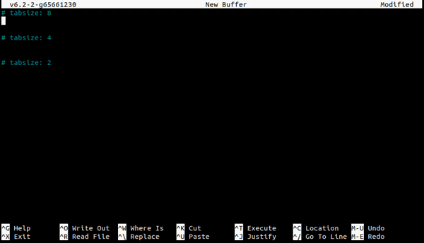

# GNU nano (6.2) - Set Tabsize Dynamically

[](https://github.com/davidhcefx/GNU-nano-6.2_Set-Tabsize-Dynamically/actions/workflows/build.yml)

Some files use *two spaces* for indentation (eg. [HTML](https://www.w3schools.com/html/html5_syntax.asp)), while others use *four* (eg. [Python](https://peps.python.org/pep-0008/#indentation)). In the middle of editing a file, I always wish I could change the **tab width** without reopening the file (= loss of history). This patch achieves our goal!

## Usage

For example, bind `M-4` to `settabsize` in your rcfile:

```nanorc
bind M-4 settabsize main
```

then you can change tabsize on the fly\!




## How to compile

*Please refer to [README.GIT](/README.GIT) for more details.*

1. Install the dependencies: `apt install autoconf automake autopoint gcc gettext git groff make pkg-config texinfo libncurses5-dev`

2. Run `./autogen.sh`.

3. After that, just do the normal `./configure`, `make` and `make install`.


## Modification Summary
```diff
diff --git a/doc/nanorc.5 b/doc/nanorc.5
index ad712e30..e7df50e0 100644
--- a/doc/nanorc.5
+++ b/doc/nanorc.5
@@ -717,6 +717,9 @@ indentation or by a preceding blank line.
 .B fulljustify
 Justifies the entire current buffer (or the marked region).
 .TP
+.B settabsize
+Prompts for a new tabsize to be set.
+.TP
 .B indent
 Indents (shifts to the right) the current line or the marked lines.
 .TP
diff --git a/src/global.c b/src/global.c
index 0a32f139..ca3723eb 100644
--- a/src/global.c
+++ b/src/global.c
@@ -659,6 +659,7 @@ void shortcut_init(void)
 	const char *pipe_gist =
 		N_("Pipe the current buffer (or marked region) to the command");
 	const char *convert_gist = N_("Do not convert from DOS/Mac format");
+	const char *settabsize_gist = N_("Set new tabsize");
 #endif
 #ifdef ENABLE_MULTIBUFFER
 	const char *newbuffer_gist = N_("Toggle the use of a new buffer");
@@ -1075,6 +1076,9 @@ void shortcut_init(void)
 #ifdef ENABLE_COLOR
 	add_to_funcs(do_formatter, MEXECUTE,
 			N_("Formatter"), WITHORSANS(formatter_gist), BLANKAFTER, NOVIEW);
+
+	add_to_funcs(do_set_tabsize, MMAIN,
+			N_("Set Tabsize"), WITHORSANS(settabsize_gist), TOGETHER, NOVIEW);
 #endif
 
 #ifdef ENABLE_HELP
@@ -1201,6 +1205,7 @@ void shortcut_init(void)
 	if (!ISSET(PRESERVE))
 		add_to_sclist(MEXECUTE, "^S", 0, do_spell, 0);
 	add_to_sclist(MEXECUTE, "^T", 0, do_spell, 0);
+	add_to_sclist(MMAIN, "M-4", 0, do_set_tabsize, 0);
 #else
 	add_to_sclist(MMAIN, "^T", 0, do_spell, 0);
 #endif
diff --git a/src/prototypes.h b/src/prototypes.h
index cf79680e..2ebfee09 100644
--- a/src/prototypes.h
+++ b/src/prototypes.h
@@ -476,6 +476,7 @@ void to_next_anchor(void);
 /* Most functions in text.c. */
 #ifndef NANO_TINY
 void do_mark(void);
+void do_set_tabsize(void);
 #endif
 void do_tab(void);
 #ifndef NANO_TINY
diff --git a/src/rcfile.c b/src/rcfile.c
index 049a2886..78fa07dd 100644
--- a/src/rcfile.c
+++ b/src/rcfile.c
@@ -410,6 +410,8 @@ keystruct *strtosc(const char *input)
 		s->func = flip_replace;
 	else if (!strcmp(input, "flipgoto"))
 		s->func = flip_goto;
+	else if (!strcmp(input, "settabsize"))
+		s->func = do_set_tabsize;
 #ifdef ENABLE_HISTORIES
 	else if (!strcmp(input, "older"))
 		s->func = get_older_item;
diff --git a/src/text.c b/src/text.c
index 85d1bd40..95a17d43 100644
--- a/src/text.c
+++ b/src/text.c
@@ -58,6 +58,28 @@ void do_mark(void)
 		refresh_needed = TRUE;
 	}
 }
+
+/* Prompt user to set the new tabsize. We use the spell menu because
+ * it has no functions. */
+void do_set_tabsize(void)
+{
+	ssize_t new_tabsize = -1;
+	int response = do_prompt(MSPELL, "", NULL, edit_refresh, "New tabsize");
+
+	/* Cancel if no answer provided. */
+	if (response != 0) {
+		statusbar(_("Cancelled"));
+		return;
+	}
+
+	if (!parse_num(answer, &new_tabsize) || new_tabsize <= 0) {
+		statusline(AHEM, _("Requested tab size \"%s\" is invalid"), answer);
+		return;
+	}
+
+	tabsize = new_tabsize;
+	statusline(REMARK, _("Tabsize set to %d"), tabsize);
+}
 #endif
 
 /* Insert a tab.  Or, if --tabstospaces is in effect, insert the number
```
